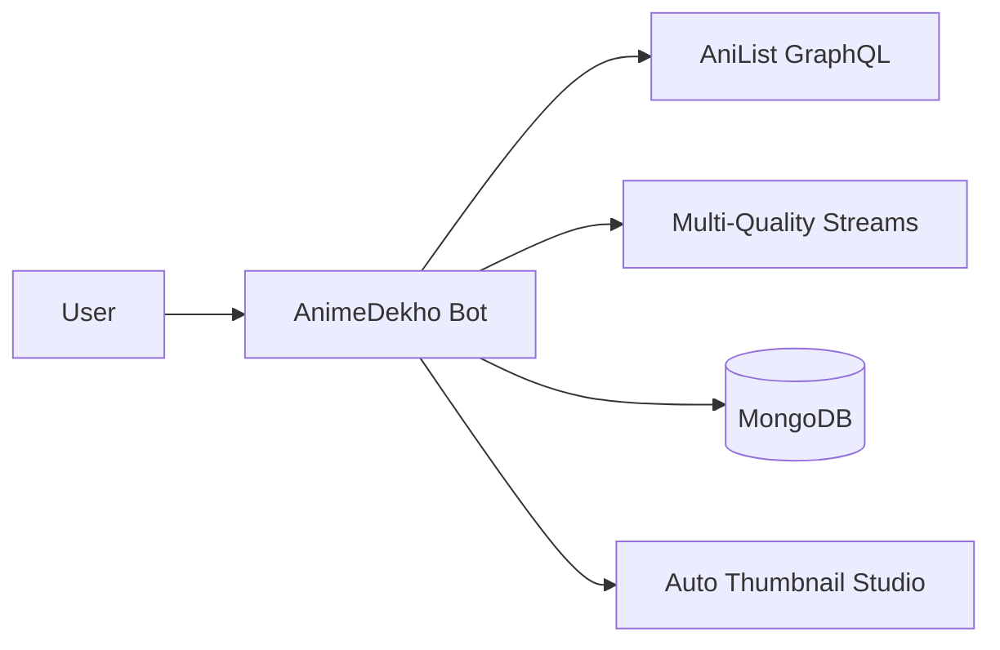

<div align="center">

# 🌟 **ANIME DEKHO BOT** 🌟

<p align="center">
  
</p>

### ⚡ **Next-Gen Anime Streaming, Archival & Channel Automation Engine** ⚡

<p align="center">
  <a href="https://python.org"></a>
  <a href="https://github.com/TgbotWorld/animedekho-bot"></a>
  <a href="https://mongodb.com"></a>
  <a href="https://anilist.co"></a>
  <a href="./LICENSE"></a>
</p>

<p align="center">
  <a href="#-flagship-features">🔥 Features</a> • 
  <a href="#-quick-commands">⚡ Commands</a> • 
  <a href="#-configuration-guide">⚙️ Config</a> • 
  <a href="#-vps-deployment">🚀 Deploy</a>
</p>

</div>

---

## 🌌 What is AnimeDekho Bot?

**AnimeDekho Bot** is a powerful automated Telegram engine that turns any anime channel into a professional streaming + archival platform.

It fetches official AniList HD art, downloads multi-quality anime streams (480p → 4K), auto-generates stunning thumbnails, and maintains **single-post-per-anime** albums with zero duplicates.



---

## 🔥 Flagship Features

### 🎨 Auto Thumbnail Studio (5 Premium Styles)

Automatically generates beautiful 1280x720 HD thumbnails every time. 5 stunning designs + random mode!

| Style          | Vibe                          | Perfect For                  |
|----------------|-------------------------------|------------------------------|
| `modern`       | High-contrast dark neon       | Weekly TV episodes           |
| `cinematic`    | Indigo widescreen letterbox   | Movies & long story arcs     |
| `movie_gold`   | Luxury metallic gold frame    | OVAs & feature films         |
| `neon_cyber`   | Electric cyan + hot pink      | Shonen, Sci-Fi, Action       |
| `minimal`      | Clean frosted glass look      | Aesthetic index channels     |
| `random`       | Dynamic every upload          | Surprise factor              |

### ⭐ Premium Telegram Emojis

Full support for Telegram Premium custom emojis with beautiful Unicode fallback.

### 📚 Smart Library Engine

- **Single master post per anime** — Updates in-place when new episodes drop
- **Auto movie → series routing** — Jujutsu Kaisen 0 goes to its parent series
- **New episode notification thread** with clean HTML formatting
- **Channel navigation buttons** + optional ongoing broadcast channel

### 🔒 Advanced Security

- 2-minute expiring invite links
- Auto media delete with countdown
- Unlimited child worker bots for load balancing
- Full privacy & rate-limit protection

---

## ⚡ Quick Commands

| Command       | Description                              |
|---------------|------------------------------------------|
| `/start`      | Main menu + welcome banner               |
| `/search`     | Anime search across database              |
| `/commands`   | Interactive command guide                 |
| `/settings`   | Real-time admin panel (admins only)       |

*(Full command list available in-bot with `/commands`)*

---

## ⚙️ Configuration

Edit `config.py` or use `.env` file:

| Variable                | Description                                      | Default     |
|-------------------------|--------------------------------------------------|-------------|
| `BOT_TOKEN`             | Telegram Bot Token                               | Required    |
| `API_ID`                | Telegram API ID                                  | Required    |
| `API_HASH`              | Telegram API Hash                                | Required    |
| `OWNER_ID`              | Your Telegram ID                                 | Required    |
| `MAIN_CHANNEL`          | Main library channel                             | `0`         |
| `THUMB_TEMPLATE`        | Thumbnail style (`modern`, `cinematic` etc.)     | `modern`    |
| `RANDOM_THUMB_TEMPLATE` | Random style every upload                        | `false`     |
| `AUTO_DELETE_TIME`      | Media auto-delete timer (seconds)                | `600`       |
| `MONGO_URI`             | MongoDB connection string                        | —           |

---

## 🚀 Quick Start

```bash
# 1. Clone
git clone https://github.com/TgbotWorld/animedekho-bot.git
cd animedekho-bot

# 2. Setup
python3 -m venv venv
source venv/bin/activate
pip install -r requirements.txt

# 3. Configure
cp sample.env .env
# Edit .env or config.py

# 4. Run
python3 main.py
```

**Production ready** with Systemd support, Docker, Railway, and more.

---

## 📜 License

MIT License — Free to use and modify!

<div align="center">
  <p><strong>Made with ❤️ for the Anime Community</strong></p>
</div>

