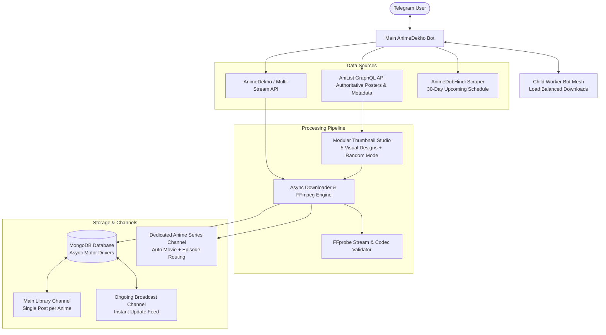

# AnimeDekho Bot

<p align="center">
  
</p>

<p align="center">
  <b>Next-Generation Telegram Anime Streaming, Archival & Library Automation System</b><br>
  <i>Ultra-fast multi-server downloading, AniList official metadata, modular 5-style thumbnail generation, intelligent movie-to-series routing, and Telegram Premium custom emoji support.</i>
</p>

<p align="center">
  <a href="https://www.python.org/"></a>
  <a href="https://github.com/TgbotWorld/animedekho-bot"></a>
  <a href="https://www.mongodb.com/"></a>
  <a href="https://anilist.co/"></a>
  <a href="./LICENSE"></a>
</p>

---

## Table of Contents

- [Overview](#overview)
- [System Architecture](#system-architecture)
- [Key Innovations & Features](#key-innovations--features)
  - [1. Modular Auto-Thumbnail Studio](#1-modular-auto-thumbnail-studio)
  - [2. Telegram Premium Custom Emoji Integration](#2-telegram-premium-custom-emoji-integration)
  - [3. Main Library Channel & In-Place Updates](#3-main-library-channel--in-place-updates)
  - [4. Smart Movie-to-Series Channel Routing](#4-smart-movie-to-series-channel-routing)
  - [5. Multi-Worker Child Bot Mesh](#5-multi-worker-child-bot-mesh)
  - [6. Anti-Copyright & Privacy Protection](#6-anti-copyright--privacy-protection)
  - [7. Dual Configuration Engine](#7-dual-configuration-engine)
- [Interactive Bot Controls](#interactive-bot-controls)
- [Configuration Reference](#configuration-reference)
- [Quick Start & Deployment](#quick-start--deployment)
  - [Prerequisites](#prerequisites)
  - [Standard Linux VPS Deployment](#standard-linux-vps-deployment)
  - [Production Systemd Service](#production-systemd-service)
- [Command Reference](#command-reference)
- [Contributing & License](#contributing--license)

---

## Overview

**AnimeDekho Bot** is an enterprise-grade Telegram bot engineered for anime streaming communities, channel networks, and archival indexers. It automates the entire lifecycle of discovering anime, fetching official high-definition artwork from AniList, transcoding/downloading multi-quality streams (480p, 720p, 1080p, 4K), generating customized branded video thumbnails, and publishing organized single-post album catalogs into Telegram channels.

Unlike traditional bots with duplicated channel clutter, AnimeDekho Bot maintains a **strict single post per anime series** in the library channel, automatically updates existing posts when new episodes drop, and dispatches dynamic notification threads for instant user delivery.

---

## System Architecture



---

## Key Innovations & Features

### 1. Modular Auto-Thumbnail Studio
The bot features a built-in PIL-based thumbnail generation engine that automatically creates pristine **1280x720 HD (16:9)** thumbnails containing official artwork, season/episode indicators, audio language pills, and bot watermarks.

Choose your preferred aesthetic in `config.py` or switch on the fly via `/settings`:

| Template Style | Visual Aesthetic | Ideal For |
| :--- | :--- | :--- |
| **`modern`** | Vibrant dual-gradient overlay with rounded poster and high-contrast pills | General TV series & weekly anime drops |
| **`cinematic`** | Deep indigo glow with 16:9 widescreen letterboxing and silver framing | Theatrical movies & dramatic story arcs |
| **`movie_gold`** | Luxury obsidian backdrop with gold metallic borders and VIP star insignia | Feature films, OVA specials & 4K releases |
| **`neon_cyber`** | Cyberpunk theme with electric cyan & hot pink glowing geometric borders | Shonen, Sci-Fi & futuristic action anime |
| **`minimal`** | Translucent frosted glass card with uncluttered typography and soft shadows | Clean minimalist channels & aesthetic indexers |
| **`random`** | Automatically picks a different design on every single episode upload | Channels desiring varied, dynamic post aesthetics |

### 2. Telegram Premium Custom Emoji Integration
- Native support for Telegram Premium custom emoji formatting (`<emoji id="...">`).
- Configurable directly via `config.py` and `.env` using real 64-bit Telegram emoji IDs.
- **Graceful Zero-Crash Fallback**: If custom emojis are disabled or unsupported by the client, the bot instantly renders clean standard Unicode symbols (e.g. ⭐, 🎬, 🔊, 📷, 🎭, ➽, ✓) with zero runtime exceptions.
- Fully integrated into `/start` welcome screens, delivery messages, and library posts.

### 3. Main Library Channel & In-Place Updates
- **Single Master Post per Anime**: Maintains exactly one message per series in your main index channel. When episode 4 releases, the bot edits the existing post rather than flooding subscribers with duplicate posts.
- **New Episode Reply Notifications**: When a new episode is published, the bot sends an automated reply to the series' main post:
  ```text
  The Angel Next Door Spoils Me Rotten
  ──────────────────────
  • S2 | Episode 04 | #Added ✓

  Start The Bot And Get Linke Here
  ```
  *(Text hyperlink directly opens the bot's instant file delivery flow without any cluttering inline buttons).*
- **`DOWNLOAD` & `DOWNLOAD NETWORK` Buttons**:
  - `DOWNLOAD` routes users directly into the specific anime's mapped channel join flow.
  - `DOWNLOAD NETWORK` directs users to your main network channel.
- **Optional Ongoing Channel Feed**: Broadcasts new episode announcements to a dedicated ongoing releases channel (`ONGOING_CHANNEL`).

### 4. Smart Movie-to-Series Channel Routing
- Movies belonging to an anime franchise (e.g. *Demon Slayer: Mugen Train*, *Jujutsu Kaisen 0*) are automatically recognized and routed into the **existing parent anime series channel**.
- Prevents channel fragmentation and keeps entire franchises neatly organized under one roof.

### 5. Multi-Worker Child Bot Mesh
- Overcome Telegram's per-bot rate limits and bandwidth throttling.
- Add auxiliary worker bots with `/addbot <token>`; the system automatically balances user file requests across all registered bots based on file quality and server load.

### 6. Anti-Copyright & Privacy Protection
- **2-Minute Expiring Invite Links**: Generates dynamic, time-limited channel invite links (`expire_date = now + 120s`) to prevent link scraping and protect channels from copyright strikes.
- **Configurable Auto-Deletion**: Automatically purges delivered media files from user private chats after a set duration (e.g., 10 minutes) with an integrated countdown clock.

### 7. Dual Configuration Engine
- Edit `config.py` directly for convenient development and hardcoded presets.
- Use `.env` environment variables for containerized / Cloud deployments (Docker, VPS, Kubernetes).
- Settings from both sources are automatically parsed with full type validation and sensible defaults.

---

## Interactive Bot Controls

### Real-Time `/settings` Control Panel
Bot owners and administrators can configure operational parameters in real time via an interactive visual dashboard without restarting the process:

- **Custom Emoji Toggle**: Enable or disable Telegram Premium custom emojis.
- **Thumbnail Template Cycler**: Cycle between Modern, Cinematic, Movie Gold, Neon Cyber, and Minimal designs.
- **Random Thumbnail Toggle**: Enable dynamic per-upload style selection.
- **Auto-Search Trigger**: Toggle whether typing anime names directly triggers search.
- **Force Subscribe (FSub) Timer**: Switch between 2-minute expiring links and standard links.
- **Auto-Delete Timer**: Cycle file deletion duration (Disabled, 5m, 10m, 30m, 1h).
- **UI Themes**: Switch between Classic and Modern layouts for Start, Schedule, and Episode cards.

---

## Configuration Reference

Configure the bot by editing [`config.py`](file:///workspaces/animedekho-bot/config.py) or by populating a `.env` file:

| Parameter | Required | Default | Description |
| :--- | :---: | :---: | :--- |
| `API_ID` | **Yes** | — | Telegram API ID from [my.telegram.org](https://my.telegram.org) |
| `API_HASH` | **Yes** | — | Telegram API Hash from [my.telegram.org](https://my.telegram.org) |
| `BOT_TOKEN` | **Yes** | — | Telegram Bot Token from [@BotFather](https://t.me/BotFather) |
| `OWNER_ID` | **Yes** | — | Telegram User ID of the primary administrator |
| `ADMINS` | No | `""` | Additional Admin User IDs separated by spaces |
| `MAIN_CHANNEL` | No | `0` | Main Channel ID for single-post series albums (e.g. `-1001234567890`) |
| `ONGOING_CHANNEL` | No | `0` | Channel ID for live new-episode notifications |
| `LOG_CHANNEL` | No | `0` | Storage channel for diagnostic logs and error traces |
| `DUMP_CHANNEL` | No | `0` | File cache storage channel |
| `MONGO_URI` | No | `mongodb://localhost:27017` | MongoDB connection URI (Atlas or self-hosted) |
| `NETWORK_CHANNEL_LINK` | No | `https://t.me/animedekho` | Destination link for the `DOWNLOAD NETWORK` button |
| `ENABLE_CUSTOM_EMOJI` | No | `false` | Enable rendering of Telegram Premium custom emojis |
| `THUMB_TEMPLATE` | No | `modern` | Active thumbnail design (`modern`, `cinematic`, `movie_gold`, `neon_cyber`, `minimal`) |
| `RANDOM_THUMB_TEMPLATE`| No | `false` | When true, chooses a random thumbnail design on every upload |
| `AUTO_SEARCH` | No | `true` | Trigger search when anime name is typed directly in chat |
| `AUTO_THUMB` | No | `true` | Generate 1280x720 HD thumbnails for video uploads |
| `AUTO_DELETE_TIME` | No | `600` | Delivered video auto-delete timer in seconds (`0` = disabled) |
| `FSUB_MOD` | No | `true` | Use 2-minute expiring invite links for Force-Subscribe |
| `START_STYLE` | No | `classic` | `/start` layout theme (`classic` or `modern`) |
| `POST_STYLE` | No | `classic` | Channel library card style (`classic` or `modern`) |
| `AI_API_KEY` | No | `""` | API key for `/ai` assistant (OpenAI, Gemini, OpenRouter) |
| `AI_MODEL` | No | `gpt-4o` | Model name for conversational query assistance |

---

## Quick Start & Deployment

### Prerequisites
- **Python**: 3.10, 3.11, 3.12, or 3.14
- **FFmpeg**: Required for video integrity validation and thumbnail extraction
- **MongoDB**: Local server (`mongod`) or free [MongoDB Atlas](https://www.mongodb.com/atlas) cluster

### Standard Linux VPS Deployment

```bash
# 1. Update system packages and install FFmpeg
sudo apt update && sudo apt install -y python3 python3-pip python3-venv ffmpeg git

# 2. Clone the repository
git clone https://github.com/TgbotWorld/animedekho-bot.git
cd animedekho-bot

# 3. Create and activate a virtual environment
python3 -m venv venv
source venv/bin/activate

# 4. Install dependencies
pip install --upgrade pip
pip install -r requirements.txt

# 5. Set up configuration
cp sample.env .env
nano .env   # (or edit config.py directly)

# 6. Start the bot
python3 main.py
```

### Production Systemd Service

To keep the bot running 24/7 with automatic restarts on reboot:

```ini
# /etc/systemd/system/animedekho.service
[Unit]
Description=AnimeDekho Telegram Bot Service
After=network.target

[Service]
Type=simple
User=root
WorkingDirectory=/root/animedekho-bot
ExecStart=/root/animedekho-bot/venv/bin/python3 main.py
Restart=always
RestartSec=5
LimitNOFILE=65535

[Install]
WantedBy=multi-user.target
```

Enable and start the service:
```bash
sudo systemctl daemon-reload
sudo systemctl enable animedekho
sudo systemctl start animedekho
sudo systemctl status animedekho
```

---

## Command Reference

### Public User Commands
| Command | Description |
| :--- | :--- |
| `/start` | Open the main menu, view featured releases, or handle deep links |
| `/search <title>` | Search the complete anime series and movie catalog |
| `/schedule` | View the 30-day upcoming dubbed anime release schedule |
| `/commands` | Interactive visual command catalog |
| `/help` | Detailed bot usage instructions and support info |

### Administrator & Owner Commands
| Command | Description |
| :--- | :--- |
| `/settings` | Open the real-time visual control panel |
| `/stats` | View VPS hardware telemetry (CPU, RAM, Disk, Uptime) |
| `/health` | Diagnostic self-check for Main Bot, Userbot, Child Bots & DB |
| `/users` | Registered user counts and activity metrics |
| `/broadcast <msg>` | Broadcast announcements to all bot users |
| `/autosearch <on\|off>`| Toggle direct chat text search trigger |
| `/automonitor <on\|off>`| Toggle automated background episode watcher |
| `/setthumb` | Set a persistent custom thumbnail (reply to photo) |
| `/delthumb` | Remove the custom thumbnail |
| `/mapchannel <slug> <cid>` | Map anime series uploads to a dedicated channel |
| `/addbot <token>` | Register a child worker bot to distribute download traffic |
| `/login` | Interactive MTProto userbot login session setup |
| `/ai <prompt>` | Query the natural-language anime assistant |

---

## Contributing & License

Contributions, bug reports, and feature requests are welcome! Feel free to open an issue or pull request on GitHub.

Distributed under the **MIT License**. See [`LICENSE`](file:///workspaces/animedekho-bot/LICENSE) for more information.

<p align="center">
  <b>Built with ❤️ by the AnimeDekho Community</b>
</p>
